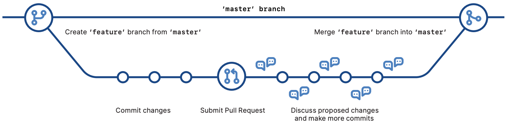

# Document Editing

Classical procedure:
Create -> Edit -> Save -> Edit -> Save ...

Classical output:

## Beyond classical document editing

- For efficient document editing, the following has to be known for each document version:

  1. When the file was modified
  2. What changed
  3. Why it was modified
  4. Who did the change (collaborative projects)

# Version control

- Also called "Revision control", "source control", "source code management"...
- System that allows one to:
  - Record the entire history of a file;
  - Revert to a specific version of the file;
  - Collaborate on the same platform with other people;
  - Make changes without modifying the main file and add them once you feel comfortable with them.
- Multiple systems and software
  - *Mercurial, Git, Subversion, CVS, PerForce*...

## Basics

  - A version control system manages the interactions between one or more **repositories** that record changes in a file system and **working copies** of that file system on which the users actually work on.
    - Users edit their working copies, without affecting other users' working copies
    - When a user is happy with the edits made, the latter are commited to a repository.
    - Other users can then update their working copy to incorporate these edits or any other edit that has been added to the repository since the last time they have updated.

## Subversion, PerForce, CVS...

- Each user has a working copy, but there is just one repository. As soon as users **commit**, it is possible for other users to **update** and to see changes

## Git, Mercurial...

 
- **commit** and **update** move changes between a working copy and a local repository, without affecting other repositories
- **push** and **pull** move changes between the local and central repositories, without affecting working copies.

# Git

- Created by Linus Torvalds (2005) for Linux
- [Cheatsheet](https://training.github.com/downloads/github-git-cheat-sheet.pdf)

## Basic workflow

  1- Edit files and check the status of the local folder

    $ git status
    
  2- Add files to the staging area

    $ git add file1.R file2.R file3.R
    
  3- Commit the changes to the local reposotiry

    $ git commit -m 'Commit message that explains the changes'

  4- Push the changes to the remote repository

    $ git push origin master

## Why Git?

- Free and open source
- Speed
  - No need to connect to a central server
- Many can work on the same file at the same time
- Every change to your code creates a new branch
  - Allows for unfinished or untested code to be committed
    - Fast code feedback
- Projects can easily be reset at an earlier phase.
  -  Creates a safer environment for the project and code
  -  Fosters creative and innovative development

## ... in Academia?

- Increasingly collaborative and multinational projects
- Transparency
- Data Sharing
- Reproducibility
- Reusability
- "Gitification" of research output?
- Teaching and formation?

# GitHub

- Largest web-based git repository hosting service
- Extra functionalities
  - User Interface: [GitHub Desktop](https://desktop.github.com/)
  - Pull Requests
  - Free Website Hosting: [GitHub Pages](https://pages.github.com/)
  - ...
  - **Course management system:** [GitHub Classroom](https://classroom.github.com/)
  
# GitHubClassroom

- Teaching tool that lets teachers and school administrators create and manage digital classrooms
  - Assignment management
    - Create assignments for individual students or groups of students
    - Assignment templates
    - Set due dates
    - Track assignments on teacher dashboard.
    - Autograding
    - Feedback pull requests

[Click here to see more](https://docs.github.com/en/education/manage-coursework-with-github-classroom)

